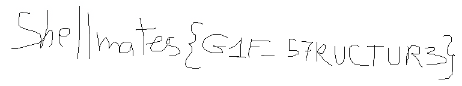

# G-101

## Write-up

GIFs are used by most of us (especially memers) but do we know its structure ? 

You will need to dig deep in the GIF file format structure:

https://www.fileformat.info/format/gif/egff.htm 

NB: I will be using 010 Editor to demonstrate the structure.

GIF file always begins with a Header and a Logical Screen Descriptor. 
A Global Color Table may optionally appear after the Logical Screen Descriptor. 
Each of these three sections is always found at the same offset 
from the start of the file. Simply, a GIF is a collection of multiple images. 
Each image stored in the file contains a Local Image Descriptor, 
an optional Local Color Table, and a block of image data. 
The last field in every GIF file is a Terminator character, 
which indicates the end of the GIF data stream.

What's interesting for us here is the The Logical Screen Descriptor.
It contains information describing the screen and color information used to 
create and display the GIF file image. 

For our case we got the Width x Height of Display Screen in Pixels is **769x144** :


Then if we check the DATA field of our GIF, we will find 3 images :


Here, we can 2 paths either we extract the 3 images and start comparing between them
or we can keep comparing between them using an editor like 010 Editor.

Each Image will contain mostly 3 big sections : Local Image Descriptor, 
Local COlor Table and Image Data.

After checking those 3 images, we will notice that there is 1 difference in 
the ImageDescriptor section, exactly in the fields ImageWidth x ImageHeight.
The 2nd image has a Width x Height of **144x769** instead if **769x144** :


Now, it is clear that we need to fix the size of the 2nd Image. 
We can do that directly with an editor :


If now we save the file and view it, we see fast glimpse of the second image.
What we can do is extract the images from GIF using the convert command :

```bash
convert chall-fixed.gif flag.png
```

This will result in the creation of 3 files : flag-0.png , flag-1.png 
and flag-2.png.

flag-1.png contains the real flag :



What did we learn from this ? a GIF contains Logical Screen Descriptor 
which only represents the logical screen (width, height, colors) of what is
shown on the whole GIF. Then each Image inside a GIF will have its own Local
Image Descriptor which represents the true physical data of the image shown.
In our case the 2nd image was inverted and that's why we couldn't see the flag.

## Flag

`shellmates{G1F_57RUCTUR3}`
