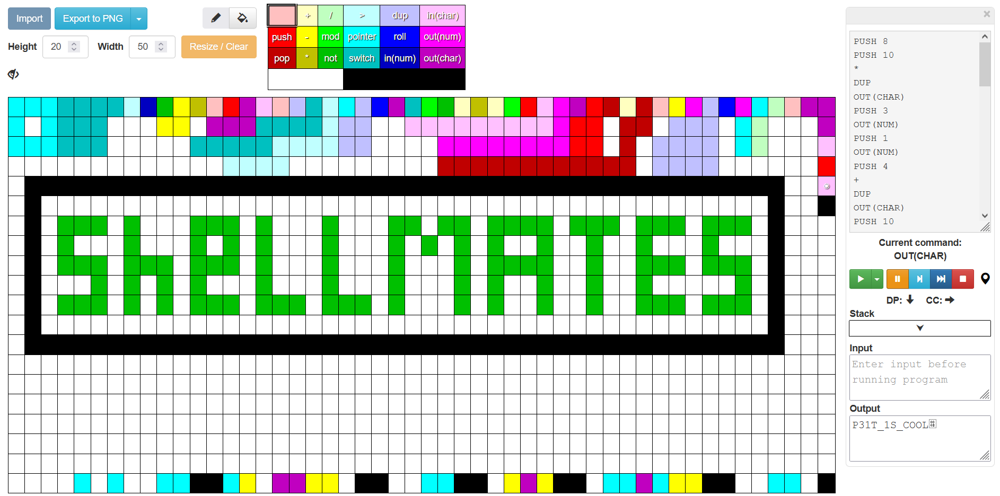

# NFT

## Write-up

This image is a ``Code`` written in  ```PIET``` which is an esoteric visual programming language.  
There is a lot of `PIET` debuggers, we can use [this debugger](https://gabriellesc.github.io/piet/).



Just compile it and u get the secret in ``output`` field

## Flag

`shellmates{P13T_1S_COOL}`
